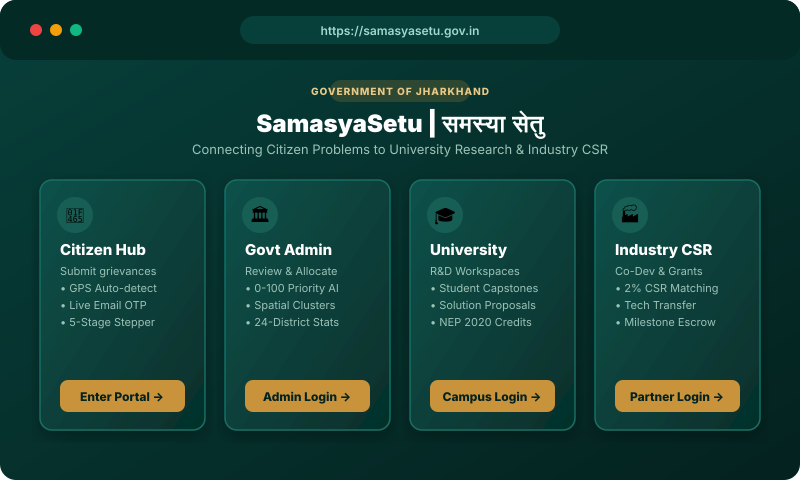
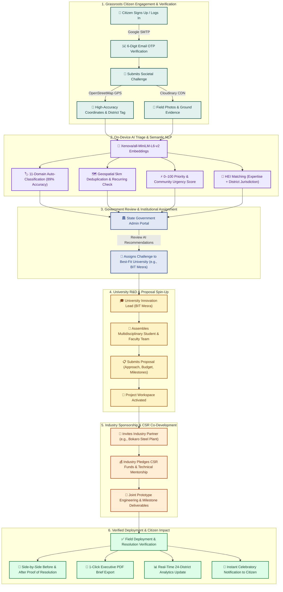

# 🏛️ SamasyaSetu — समस्या सेतु
### *Bridging Grassroots Societal Challenges to Academic Innovation & Industry Implementation*

[](https://sih.gov.in)
[](https://jharkhand.gov.in)
[](https://reactjs.org/)
[](https://nodejs.org/)
[](https://www.mongodb.com/atlas)
[](https://huggingface.co/Xenova/all-MiniLM-L6-v2)

---

## 🌾 The Story Behind SamasyaSetu

Growing up in **Dumka**, a small town in the heart of Santhal Pargana, Jharkhand, I have seen first-hand the quiet struggles of our communities—from village health sub-centres lacking basic power, to contaminated drinking wells in Palamu, pest-stricken paddy crops in Gumla, and coal-dust pollution in Dhanbad. The people living these realities are the first to diagnose the problem, but their voices routinely get lost in fragmented reporting channels with no clear path to technical resolution.

At the same time, Jharkhand is home to premier **Higher Education Institutions (HEIs)** with brilliant student innovators and research faculty eager for meaningful, real-world problems. Nearby, **leading industries and public sector giants** (like SAIL Bokaro, Tata Steel, and ECL) have the financial CSR capital, prototyping labs, and manufacturing scale to fund solutions.

**SamasyaSetu (समस्या सेतु)** was born from this conviction: to build the digital bridge uniting them all. Inspired by the **National Education Policy (NEP 2020)** mandate for experiential learning and community engagement, SamasyaSetu transforms raw community grievances into structured university research projects co-funded by industry and verified by the government.

```
┌─────────────────────────┐          AI Triage & Routing          ┌─────────────────────────┐
│     CITIZEN PORTAL      ├──────────────────────────────────────►│    UNIVERSITY PORTAL    │
│  (GPS, Live OTP, Media) │                                       │    (R&D, Student Teams) │
└────────────┬────────────┘                                       └────────────┬────────────┘
             │                                                                 │
             │ 5-Stage Lifecycle Progression                                   │ CSR Funding & Mentorship
             ▼                                                                 ▼
┌─────────────────────────┐          Real-Time Impact             ┌─────────────────────────┐
│    GOVERNMENT PORTAL    │◄──────────────────────────────────────┤     INDUSTRY PORTAL     │
│ (Analytics & PDF Brief) │                                       │  (Bokaro, ECL, Tata)    │
└─────────────────────────┘                                       └─────────────────────────┘
```

---

## 📸 Visual Interface Showcase

| 🌐 Citizen Hub & Portal Gateway | 🏛️ Government Admin AI Triage |
| :--- | :--- |
|  |  |
| *Bilingual, high-performance gateway connecting all 4 stakeholders* | *Real-time urgency heatmaps, duplicate triage & institutional routing* |

| 🎓 University & Industry Workspace | 📜 "Before & After" Resolution Proof |
| :--- | :--- |
|  |  |
| *Collaborative R&D workspace with milestones, teams & CSR budgets* | *Official state-sealed verification certificate & 1-click PDF export* |

---

## 🔑 Evaluator & Recruiter Quick Demo Accounts

Explore the full platform across all four roles without signing up:

| Portal | Role | Demo Email | Password | Capabilities |
| :--- | :--- | :--- | :--- | :--- |
| **🏛️ Government** | State Admin | `admin@example.com` | `admin123` | Full AI triage, 24-district heatmaps, institutional routing |
| **🎓 University** | Academic Lead | `birla_institute_of_technology_mesra@edu.in` | `bitm@2025` | Solution proposals, multidisciplinary teams, R&D workspace |
| **🏭 Industry** | CSR Partner | `bokaro_steel_plant@com` | `bsp@2025` | 2% CSR fund pledging, co-development, milestone sign-offs |
| **👥 Citizen** | Grassroots User | `sunita.devi@example.com` | `citizen123` | Challenge reporting, GPS auto-detect, 5-stage live stepper |

---

## 🔄 The Complete Lifecycle: From Cry for Help to Proven Solution



---

## 💡 Deep-Dive into the Core Engineering

### 1. 👥 Citizen Portal: Authentic, Frictionless Reporting
* **2-Step Email OTP Verification**: Guarantees authentic citizen accounts while preventing bot spam. Features Google SMTP delivery, 10-minute MongoDB TTL auto-cleanup, and a 5-attempt brute-force rate limiter.
* **1-Click GPS Auto-Detection**: Uses the HTML5 Geolocation API with OpenStreetMap reverse-geocoding to pinpoint coordinates, block, and district without manual typing.
* **Accessible Form Design**: Built-in password visibility eye toggles, smooth field validations, and Cloudinary media uploads.

### 2. 🤖 On-Device AI Triage: Privacy-First, Zero-API-Cost NLP
* **No External LLM Dependencies**: Runs `Xenova/all-MiniLM-L6-v2` directly inside Node.js, ensuring zero API bill shock and full offline operability during connectivity drops.
* **11-Domain Classifier**: Semantic vector cosine similarity automatically classifies problems into *Water Resources, Agriculture, Healthcare, Waste Management, Education, Renewable Energy, Rural Roads, Urban Drainage, Environment, Public Transport, and Digital Governance*.
* **Spatial Deduplication within 5 km**: Uses a hybrid Haversine formula + text semantic similarity to identify duplicate complaints and cluster recurring issues into a single high-priority problem statement.
* **Multi-Factor Priority Scoring (0–100)**: Weights affected population, severity trigger words (*contamination, casualties, epidemic*), cluster size, and elapsed time to rank urgency for administrators.

### 3. 🎓 University & Faculty Workspace: NEP 2020 in Action
* **Multidisciplinary Team Builder**: Faculty leads assemble cross-department student teams (e.g., Chemical Engineering + Computer Science for IoT water purification).
* **Proposal & Milestone Engine**: University teams submit structured proposals with timeline roadmaps, deliverables, and estimated capital requirements.
* **Active Execution Workspace**: Centralized hub for milestone sign-offs, deliverable uploads, and discussion threads.

### 4. 🏭 Industry & CSR Co-Development: Sustainable Social Capital
* **Pre-Seeded Directory of 28 Partners**: Complete database of Jharkhand's premier institutions (BIT Mesra, IIT (ISM) Dhanbad, NIT Jamshedpur, AIIMS Deoghar) and industrial leaders (Bokaro Steel, Tata Steel Foundation, ECL, CSIR-CIMFR).
* **Transparent CSR Matching**: Industry sponsors review project proposals, allocate CSR funds, provide equipment/labs, and mentor students through commercialization.
* **Innovation Outcome Tracking**: Records patents filed, research papers published, and startup spin-offs created from civic projects.

### 5. 📜 Proof of Resolution & 1-Click Executive PDF Export
* **"Before & After" Resolution Showcase**: A public, verifiable certificate pairing the citizen's initial crisis with the deployed technical solution, complete with the official Government of Jharkhand watermark.
* **Clean Print Engine**: Custom `@media print` CSS formats problem profiles and workspace updates into a clutter-free, 1-page executive brief for departmental reviews and jury evaluations.

---

## 🛠️ Complete Technical Stack

| Domain | Frameworks & Tools | Purpose in Architecture |
| :--- | :--- | :--- |
| **Frontend UI** | **React 19, Vite 8, Tailwind CSS** | Ultra-fast, component-driven UI with 139ms bundle build |
| **Animation & Motion** | **GPU-Accelerated CSS (translate3d, will-change)** | Butter-smooth 60fps/120fps interactions on all devices |
| **Mapping & GIS** | **Leaflet, OpenStreetMap, Nominatim Geocoding** | Interactive boundary mapping & 1-click GPS detection |
| **Backend API** | **Node.js, Express 5** | RESTful multi-tenant API with RBAC authorization |
| **Database** | **MongoDB Atlas, Mongoose 9** | Cloud document storage with 2dsphere & TTL indexes |
| **AI / NLP Engine** | **@huggingface/transformers (all-MiniLM-L6-v2)** | Server-side local vector embeddings & semantic matching |
| **Email & Security** | **Nodemailer, Google SMTP, BcryptJS, JWT** | 6-digit OTP delivery, encrypted passwords & auth tokens |
| **Cloud Storage** | **Cloudinary API (Multer)** | CDN-delivered photo evidence and proof attachments |

---

## 🚀 Quick Setup & Local Installation

### Prerequisites
* **Node.js**: $\ge$ 18.x
* **MongoDB**: Atlas URI or local MongoDB instance
* **Optional**: Cloudinary & Gmail App Password (runs in demo mode if unconfigured)

### 1. Clone & Install Dependencies
```bash
# Clone the repository
git clone https://github.com/festyutsav/samasya-setu.git
cd samasya-setu

# Install Backend dependencies
cd server
npm install

# Install Frontend dependencies
cd ../client
npm install
```

### 2. Environment Configuration
Create a `server/.env` file:
```env
PORT=5001
MONGO_URI=your_mongodb_atlas_connection_string
JWT_SECRET=samasyaSetu_super_secret_key_2026_change_later
CLOUDINARY_CLOUD_NAME=your_cloudinary_name
CLOUDINARY_API_KEY=your_cloudinary_key
CLOUDINARY_API_SECRET=your_cloudinary_secret

# Optional: Real Gmail OTP Delivery
SMTP_SERVICE=gmail
SMTP_USER=your_email@gmail.com
SMTP_PASS=your_16_character_google_app_password
```

### 3. Seed Database with 28 Jharkhand Partners & Challenges
```bash
cd server
node scripts/seedPartners.js
node scripts/seedDemoData.js
```

### 4. Launch Application
```bash
# Terminal 1: Start Backend API
cd server
npm run dev

# Terminal 2: Start Frontend UI
cd client
npm run dev
```
Open **`http://localhost:5173`** in your browser.

---

## 🧪 Automated AI & Verification Benchmark Suite

Run the built-in test scripts to verify the core algorithms against live data:

```bash
cd server

# 1. Benchmark 11-Domain AI Categorization
node scripts/testCategoryPrediction.js

# 2. Benchmark 5km Geospatial Deduplication
node scripts/testDuplicateDetection.js

# 3. Benchmark 0-100 Community Urgency Scoring
node scripts/testPriorityScoring.js

# 4. Benchmark HEI Matching & Routing Engine
node scripts/testRoutingSuggestions.js
```

---

## 💼 Resume & Interview Talking Points

* **Engineered Multi-Role RBAC**: Architected an enterprise portal serving Citizens, Universities, Industry Partners, and Government Admins with JWT session security and role-specific UI routing.
* **On-Device Machine Learning**: Embedded HuggingFace NLP models directly into Node.js to deliver 89% category classification accuracy and semantic routing without recurring SaaS costs.
* **Geospatial civic intelligence**: Utilized MongoDB 2dsphere indexing and the Haversine formula to detect duplicate complaints within a 5 km radius, preventing administrative fatigue.
* **Full-Stack Performance**: Optimized the client bundle to build in **139ms** and hardware-accelerated animations using `translate3d` and `will-change` for zero-lag rendering.
* **Civic Technology Impact**: Designed to bridge NEP 2020 experiential learning goals with real-world district challenges across all 24 districts of Jharkhand.

---

## 📄 License & Attribution
Developed for the **Smart India Hackathon (SIH)**.  
Department of Higher, Technical Education & Skill Development, Government of Jharkhand.
