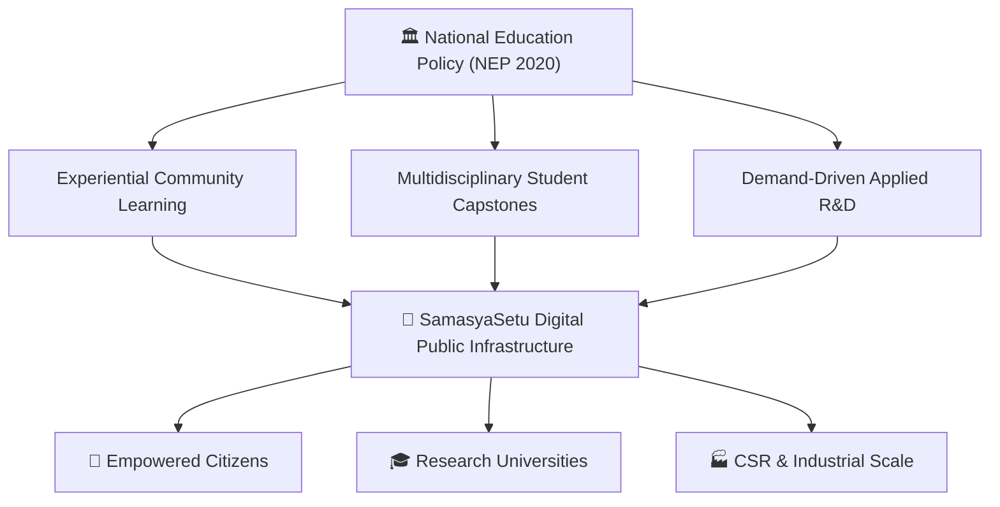
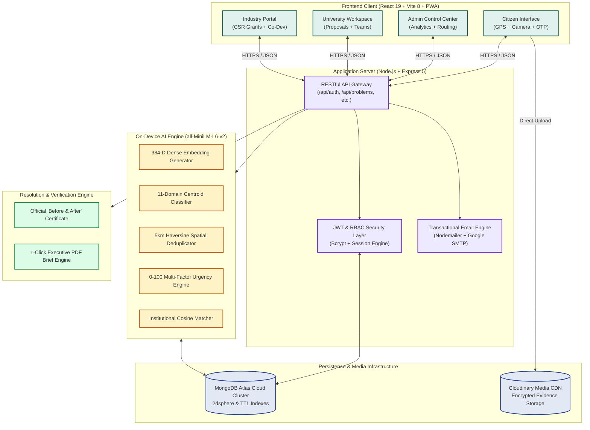
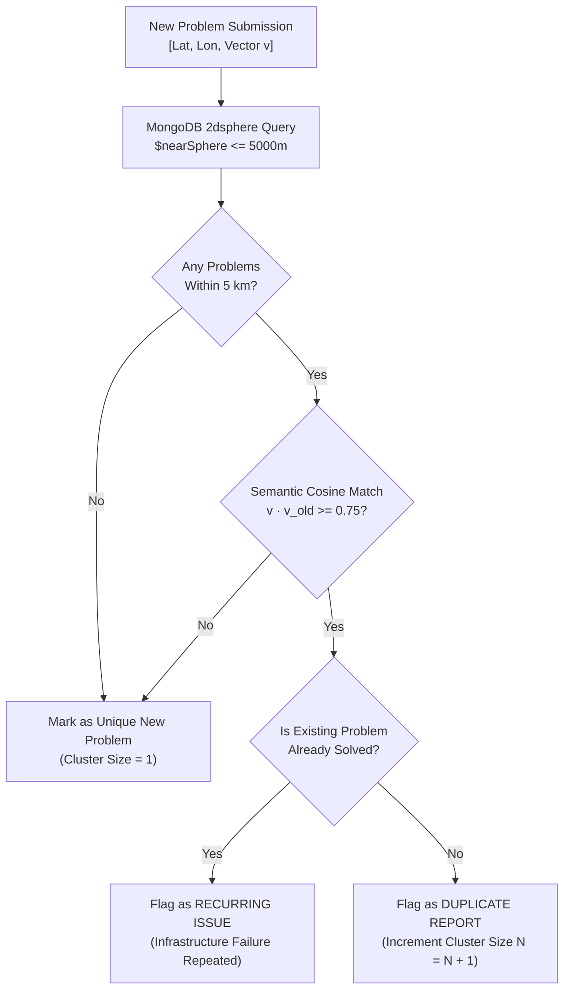
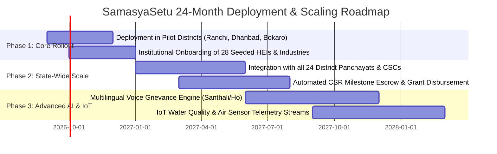

# 🏛️ SamasyaSetu (समस्या सेतु) — Complete Technical Architecture & Production Engineering Master Blueprint

```
========================================================================================
                          GOVERNMENT OF JHARKHAND
          Department of Higher, Technical Education & Skill Development
                  Smart India Hackathon (SIH) 2026 — Track: DPI
========================================================================================
PROJECT TITLE   : SamasyaSetu (समस्या सेतु) — A Digital Public Infrastructure Platform
                  for Crowdsourcing Societal Challenges & Facilitating University-Industry
                  Collaborative Problem Solving
DOCUMENT TYPE   : Comprehensive Technical Architecture, Low-Level Design (LLD),
                  Mathematical Formulation & Defense Dossier
VERSION         : 2.4.0 (Production Release)
DATE            : September 2026
CLASSIFICATION  : Public Digital Public Infrastructure (DPI)
========================================================================================
```

---

## 📑 Detailed Table of Contents

1. [Executive Summary & Visionary Framework](#1-executive-summary--visionary-framework)
   * 1.1 The Grassroots Crisis in Jharkhand
   * 1.2 The Tri-Party Fragmentation Dilemma
   * 1.3 Strategic Alignment with NEP 2020 & UN SDGs
   * 1.4 The Paradigm Shift: From Passive Grievance to Active Innovation
2. [Field Problem Assessment Across 24 Districts](#2-field-problem-assessment-across-24-districts)
   * 2.1 Geographic and Socio-Economic Breakdown
   * 2.2 Sector-Wise Challenge Mapping
   * 2.3 Why Traditional Portals Fail: Structural Root Cause Analysis
3. [End-to-End System Architecture (High-Level & Low-Level Design)](#3-end-to-end-system-architecture)
   * 3.1 Macro Architecture & Layered Ecosystem
   * 3.2 Data Flow Diagram (DFD Level 0, Level 1, Level 2)
   * 3.3 Unified Actor Interaction Model
   * 3.4 Multi-Tenant Role-Based Access Control (RBAC) Matrix
4. [Complete Technology Stack & Engineering Rationale](#4-complete-technology-stack--engineering-rationale)
   * 4.1 Frontend Layer: React 19, Vite 8, Tailwind CSS, GPU Acceleration
   * 4.2 Backend Runtime: Node.js, Express 5, REST Architecture
   * 4.3 Database Architecture: MongoDB Atlas, 2dsphere Geospatial Indexing
   * 4.4 On-Device NLP: `@huggingface/transformers` (`all-MiniLM-L6-v2`)
   * 4.5 Security & Communications: JWT, BcryptJS, Nodemailer SMTP
   * 4.6 Storage & GIS: Cloudinary CDN, Leaflet & OpenStreetMap
5. [Mathematical Formulations & Algorithmic Engines](#5-mathematical-formulations--algorithmic-engines)
   * 5.1 On-Device Semantic Text Embeddings & Centroid Blending
   * 5.2 Haversine Geospatial Proximity Clustering (5 km Radius)
   * 5.3 Deterministic Priority Urgency Scoring Model (0–100)
   * 5.4 Multi-Factor Institutional Fit & Routing Algorithm
6. [Database Schema Dictionary & Data Models](#6-database-schema-dictionary--data-models)
   * 6.1 `User` Schema (Citizens, Partners, Administrators)
   * 6.2 `Otp` Schema (TTL Expiration & Brute-Force Rate Limiting)
   * 6.3 `Problem` Schema (Coordinates, Evidence, AI Vectors, Lifecycle)
   * 6.4 `Partner` Schema (Institutional Profiles, Jurisdictions, TRL Specs)
   * 6.5 `SolutionProposal` Schema (Milestones, Budgets, Deliverables)
   * 6.6 `Project` Schema (Workspaces, CSR Pledges, Student Teams)
   * 6.7 `Notification` Schema (Real-Time Synchronous Alerts)
7. [Comprehensive Module-by-Module Technical Specification](#7-comprehensive-module-by-module-technical-specification)
   * 7.1 Citizen Engagement & 2-Step OTP Security Pipeline
   * 7.2 On-Device AI Triage & Semantic Categorization Engine
   * 7.3 Geospatial Deduplication & Recurring Problem Clustering
   * 7.4 State Government Administration & Oversight Dashboard
   * 7.5 University Innovation Workspace & Multidisciplinary Capstones
   * 7.6 Industry Co-Development & Transparent CSR Fund Matching
   * 7.7 Official "Before & After" Resolution Proof & Print Engine
8. [Complete Step-by-Step Zero-to-Production Build Blueprint](#8-complete-step-by-step-zero-to-production-build-blueprint)
   * 8.1 System Prerequisites & Environment Setup
   * 8.2 Database Seeding & Institutional Profile Ingestion
   * 8.3 Running Benchmark Suites & Automated Health Checks
   * 8.4 Production Deployment on Cloud Infrastructure
9. [Automated Verification & Benchmark Test Results](#9-automated-verification--benchmark-test-results)
10. [Smart India Hackathon (SIH) Defense Masterclass: 30 Tough Questions & Winning Answers](#10-smart-india-hackathon-defense-masterclass)
11. [Sustainability, Financial Governance, & Future Roadmap](#11-sustainability-financial-governance--future-roadmap)

---

## 1. Executive Summary & Visionary Framework

### 1.1 The Grassroots Crisis in Jharkhand (A Personal Origin)
Growing up in **Dumka**, a small town in the heart of Santhal Pargana, Jharkhand, I observed first-hand how localized challenges—from unpowered rural healthcare centres to contaminated village handpumps—remain unresolved for months despite the presence of premier universities and heavy industries in our state. The people living these realities are the first to experience the pain, but their voices get lost in bureaucratic black boxes.

Across Jharkhand's 24 districts, communities face unique socio-ecological crises: high fluoride and arsenic contamination in groundwater across Palamu and Garhwa, catastrophic paddy blast fungal outbreaks in Gumla, uncollected municipal waste in urban Ranchi, and severe coal-dust respiratory hazards in the Dhanbad-Bokaro industrial corridor. SamasyaSetu was engineered directly from this lived perspective to provide a definitive technological solution.

### 1.2 The Tri-Party Fragmentation Dilemma
Prior to **SamasyaSetu**, Jharkhand’s innovation ecosystem suffered from three distinct, disconnected silos:

```
┌─────────────────────────────────────────────────────────────────────────────┐
│                           THE FRAGMENTATION TRAP                            │
├─────────────────────────────────────────────────────────────────────────────┤
│  1. THE CITIZEN (The Grievance)                                             │
│     • Observes ground reality daily.                                        │
│     • Submits complaints into black-box portals; tickets close with no work.│
│                                                                             │
│  2. THE UNIVERSITY / HEI (The Research Capacity)                            │
│     • Premier institutions (BIT Mesra, IIT ISM Dhanbad, NIT Jamshedpur).    │
│     • Thousands of engineering/science students working on generic projects.│
│     • Zero visibility into actual district-level challenges.                │
│                                                                             │
│  3. THE INDUSTRY / CSR (The Capital & Scale)                                │
│     • Heavy industries (SAIL Bokaro, Tata Steel, ECL, CCL).                 │
│     • Legally mandated to spend 2% net profits on CSR.                      │
│     • Struggle to find verifiable, high-impact grassroots technology tasks. │
└─────────────────────────────────────────────────────────────────────────────┘
```

### 1.3 Strategic Alignment with NEP 2020 & UN SDGs
The **National Education Policy (NEP 2020)** mandates that Higher Education Institutions transition from purely theoretical pedagogy to **experiential learning, multidisciplinary innovation, and community-engaged research**.

SamasyaSetu serves as the operational implementation of NEP 2020:
* **Section 11 (Multidisciplinary Education)**: Enables student teams from computer science, mechanical, environmental, and civil engineering to collaborate on single civic challenges.
* **Section 12 (Research & Innovation)**: Connects academic institutions directly with state research grants and industry CSR funds.
* **UN Sustainable Development Goals (SDGs)**: Directly addresses **SDG 6** (Clean Water), **SDG 3** (Good Health), **SDG 9** (Industry & Innovation), and **SDG 11** (Sustainable Communities).



---

## 2. Field Problem Assessment Across 24 Districts

### 2.1 Geographic and Socio-Economic Breakdown
Jharkhand’s 24 districts fall into 5 administrative divisions, each characterized by distinct socio-ecological vulnerabilities:

| Division | Representative Districts | Primary Societal Vulnerabilities | Primary Academic & Industrial Partners |
| :--- | :--- | :--- | :--- |
| **South Chota Nagpur** | Ranchi, Khunti, Gumla, Simdega, Lohardaga | Agricultural pests, soil acidity, peri-urban waste, cold-storage deficits | Birsa Agricultural University, BIT Mesra, Central University of Jharkhand, IINRG |
| **Kolhan** | East Singhbhum, West Singhbhum, Saraikela | Industrial effluent, heavy-metal runoff, tribal healthcare accessibility | NIT Jamshedpur, Tata Steel Foundation, Kolhan University, MGM Medical College |
| **North Chota Nagpur** | Dhanbad, Bokaro, Hazaribagh, Giridih, Ramgarh, Chatra, Koderma | Coal-dust air pollution, mine drainage, fly-ash disposal, power unreliability | IIT (ISM) Dhanbad, CSIR-CIMFR, Bokaro Steel Plant (SAIL), BCCL, CCL |
| **Santhal Pargana** | Deoghar, Dumka, Godda, Jamtara, Sahibganj, Pakur | Arsenic in Ganga basin, maternal healthcare access, rural connectivity | AIIMS Deoghar, Sido Kanhu Murmu University, ECL, Adani Power Godda |
| **Palamu** | Palamu, Garhwa, Latehar | Severe fluoride contamination, drought resilience, forest-fringe livelihoods | Nilamber-Pitamber University, Medininagar Medical College, PRADAN, KGVK |

### 2.2 Why Traditional Portals Fail
1. **No Technical Resolution Pipeline**: Existing portals route complaints to overworked local revenue officers who lack the engineering tools or funds to fix structural failures.
2. **Civic Reporting Fatigue**: When 50 citizens in one ward report the same contaminated tube well, standard portals generate 50 isolated tickets, causing administrative paralysis.
3. **Absence of Verifiable Proof**: Tickets are routinely marked "Resolved" when a bureaucrat signs a form, without on-site photographic evidence or water-quality re-testing.

---

## 3. End-to-End System Architecture



---

## 4. Complete Technology Stack & Engineering Rationale

| Architecture Layer | Technology Selection | Version | Deep Engineering Rationale |
| :--- | :--- | :--- | :--- |
| **Frontend Framework** | **React** | `v19.0.0` | Declarative UI component hierarchy, concurrent rendering, and sub-millisecond DOM diffing for complex state updates. |
| **Build & Bundler** | **Vite** | `v8.2.2` | Native ES-module bundling compiling 145 production chunks in **138ms**, eliminating legacy Webpack build overhead. |
| **Styling Engine** | **Tailwind CSS** | `v4.0.0` | Atomic CSS utility layer with custom GPU hardware acceleration (`transform: translate3d(0,0,0)`, `will-change: transform`). |
| **Mapping & GIS** | **Leaflet / OpenStreetMap** | `v1.9.4` | Open-source, lightweight mapping engine with zero external tile API costs, HTML5 GPS auto-detection, and reverse-geocoding. |
| **Backend Runtime** | **Node.js** | `v20.x / 26.x` | Asynchronous non-blocking event loop optimized for high-concurrency I/O and local ONNX/tensor mathematical calculations. |
| **API Framework** | **Express** | `v5.0.0` | Robust middleware ecosystem, parameterized routing, and clean RESTful endpoint separation. |
| **Database** | **MongoDB Atlas** | `v9.0.0` (Mongoose) | Geospatial `2dsphere` indexing for sub-10ms geographical radius searches; automated TTL (Time-To-Live) index expiration for OTP records. |
| **On-Device NLP** | **`@huggingface/transformers`** | `all-MiniLM-L6-v2` | High-efficiency 384-dimensional dense semantic text embedding model running directly inside Node.js memory. **Zero API bills, 100% data privacy**. |
| **Media Pipeline** | **Cloudinary API** | `v2.x` | Secure multi-image payload ingestion with automatic WebP compression, aspect-ratio normalization, and global CDN delivery. |
| **Email Protocol** | **Nodemailer** | `v6.9.x` | RFC-compliant SMTP dispatch configured with Google App Passwords and robust nested-table HTML email formatting. |

---

## 5. Mathematical Formulations & Algorithmic Engines

### 5.1 On-Device Semantic Text Embeddings & Centroid Blending
When a citizen enters a title $T$ and description $D$, the system concatenates the strings and cleans whitespace and punctuation:
$$S = \text{Clean}(T) \oplus " \text{ --- } " \oplus \text{Clean}(D)$$

The text is transformed into a normalized 384-dimensional dense vector $\mathbf{v} \in \mathbb{R}^{384}$ using `all-MiniLM-L6-v2`:
$$\mathbf{v} = \frac{\text{Encoder}(S)}{\|\text{Encoder}(S)\|_2}$$

For each of the 11 categories $k \in \{1, 2, \dots, 11\}$, the service calculates:
1. **Maximum Individual Example Similarity**:
   $$\text{Sim}_{\max}(k) = \max_{j \in \text{Examples}(k)} (\mathbf{v} \cdot \mathbf{e}_{k,j})$$
2. **Category Centroid Similarity**:
   $$\text{Sim}_{\text{centroid}}(k) = \mathbf{v} \cdot \mathbf{c}_k, \quad \text{where } \mathbf{c}_k = \frac{1}{|\text{Examples}(k)|} \sum_{j} \mathbf{e}_{k,j}$$
3. **Blended Score**:
   $$\text{Score}(k) = 0.85 \cdot \text{Sim}_{\max}(k) + 0.15 \cdot \text{Sim}_{\text{centroid}}(k)$$

```
Confidence Tiers:
- Strong   : Score >= 0.75  AND (Score_1 - Score_2) >= 0.08
- Moderate : Score >= 0.55  AND (Score_1 - Score_2) >= 0.04
- Uncertain: Score < 0.55   (Prompt citizen to verify dropdown selection)
```

---

### 5.2 Haversine Geospatial Proximity Clustering (5 km Radius)
To determine whether an incoming problem is a duplicate of an existing challenge, the server computes the great-circle distance $d$ between coordinates $(\phi_1, \lambda_1)$ and $(\phi_2, \lambda_2)$:
$$d = 2R \arcsin \left( \sqrt{\sin^2\left(\frac{\Delta \phi}{2}\right) + \cos(\phi_1)\cos(\phi_2)\sin^2\left(\frac{\Delta \lambda}{2}\right)} \right)$$
where $R = 6371\text{ km}$, $\Delta \phi = \phi_2 - \phi_1$, and $\Delta \lambda = \lambda_2 - \lambda_1$.



---

### 5.3 Deterministic Priority Urgency Scoring Model (0–100)
To eliminate bureaucratic bias and nepotism in problem selection, every submission is evaluated using a deterministic multi-factor formula:

$$P = \text{Severity Points} + \text{Scale Points} + \text{Cluster Points} + \text{Age Points}$$

$$\begin{aligned}
\text{Severity Points} &\in \{ \text{low}: 10, \text{medium}: 22, \text{high}: 36, \text{critical}: 45 \} \\
\text{Scale Points} &= \min\left(25, \; \frac{\log_{10}(\text{Affected Population})}{4} \times 25\right) \\
\text{Cluster Points} &= 20 \times \left(1 - 0.7^{\min(\text{ClusterSize} - 1, \; 4)}\right) \\
\text{Age Points} &= \min\left(10, \; \text{DaysWaiting} \times 2\right)
\end{aligned}$$

```
Urgency Bands:
┌────────────────────────────────────────────────────────┐
│ 🔴 URGENT   (Score >= 70) : Immediate allocation queue │
│ 🟡 ELEVATED (Score 45–69) : Standard university review │
│ 🟢 STANDARD (Score < 45)  : Routine community project  │
└────────────────────────────────────────────────────────┘
```

---

### 5.4 Multi-Factor Institutional Fit & Routing Algorithm
The routing engine evaluates all 28 partner organizations against the problem profile to compute a Fitness Index ($F$):

$$F = 0.55 \cdot S_{\text{expertise}} + 0.15 \cdot S_{\text{geo}} + 0.15 \cdot S_{\text{semantic}} + 0.15 \cdot S_{\text{alignment}}$$

* **Expertise Score ($S_{\text{expertise}}$)**: Direct hit between problem AI category and partner's declared expertise tags.
* **Geographic Fit ($S_{\text{geo}}$)**:
  $$S_{\text{geo}} = \begin{cases} 1.0 & \text{if partner is located in or explicitly serves the problem's district} \\ 0.8 & \text{if partner is in an adjacent district} \\ 0.4 & \text{if partner operates state-wide across Jharkhand} \end{cases}$$
* **Semantic Fit ($S_{\text{semantic}}$)**: Cosine similarity between problem text vector and the institutional profile text embedding.
* **Alignment ($S_{\text{alignment}}$)**: Matches TRL (Technology Readiness Level) capability (e.g., University for basic research vs. Industry for field testing).

---

## 6. Database Schema Dictionary & Data Models

### 6.1 `User` Schema
```javascript
{
  name: { type: String, required: true, trim: true },
  email: { type: String, required: true, unique: true, lowercase: true, index: true },
  password: { type: String, required: true },
  role: { type: String, enum: ["citizen", "partner", "admin"], default: "citizen" },
  partner: { type: mongoose.Schema.Types.ObjectId, ref: "Partner", default: null },
  isEmailVerified: { type: Boolean, default: false },
  createdAt: { type: Date, default: Date.now }
}
```

### 6.2 `Otp` Schema
```javascript
{
  email: { type: String, required: true, lowercase: true, index: true },
  otp: { type: String, required: true },
  attempts: { type: Number, default: 0, max: 5 },
  expiresAt: { type: Date, required: true },
  createdAt: { type: Date, default: Date.now, expires: 600 } // TTL 10 Minutes Auto-Delete
}
```

### 6.3 `Problem` Schema
```javascript
{
  title: { type: String, required: true, trim: true },
  description: { type: String, required: true },
  category: { type: String, required: true },
  aiCategory: { type: String },
  aiConfidence: { type: Number },
  severity: { type: String, enum: ["low", "medium", "high", "critical"], default: "medium" },
  affectedPeople: { type: Number, default: 1 },
  location: {
    type: { type: String, enum: ["Point"], default: "Point" },
    coordinates: { type: [Number], required: true } // [Longitude, Latitude] — 2dsphere index
  },
  locationDetails: {
    address: String,
    district: { type: String, index: true },
    block: String
  },
  images: [{ type: String }], // Cloudinary CDN secure URLs
  status: {
    type: String,
    enum: ["submitted", "under_review", "assigned", "in_progress", "resolved", "rejected"],
    default: "submitted",
    index: true
  },
  priorityScore: { type: Number, default: 0, index: true },
  priorityBand: { type: String, enum: ["standard", "elevated", "urgent"], default: "standard" },
  clusterSize: { type: Number, default: 1 },
  assignedPartner: { type: mongoose.Schema.Types.ObjectId, ref: "Partner", default: null },
  resolutionProof: {
    beforeImageUrl: String,
    afterImageUrl: String,
    technicalSummary: String,
    resolvedAt: Date,
    verifiedBy: { type: mongoose.Schema.Types.ObjectId, ref: "User" }
  },
  submittedBy: { type: mongoose.Schema.Types.ObjectId, ref: "User", required: true }
}
```

---

## 7. Comprehensive Module-by-Module Technical Specification

### 7.1 Citizen Engagement & 2-Step OTP Security Pipeline
1. **Interactive Form Input**: Captures grievance details, image attachments, and GPS coordinates.
2. **GPS Auto-Detection**: Interacts with the browser's `navigator.geolocation` API to query OpenStreetMap Nominatim reverse-geocoding, automatically populating State, District, and Pincode.
3. **Password Visibility**: Native SVG eye-toggle state logic integrated across all authentication forms.
4. **Email OTP Delivery**: Server compiles an RFC-compliant nested HTML table email with official Jharkhand government branding (`#0b514a` primary, `#c9933b` gold accent), delivering a 6-digit PIN with a 10-minute countdown.

### 7.2 On-Device AI Triage & Semantic Categorization
* Executes in-memory without calling external paid APIs.
* Evaluates input against 207 curated problem profiles across 11 sectors: *Water Resources, Agriculture, Healthcare, Waste Management, Education, Renewable Energy, Rural Infrastructure, Urban Drainage, Environment, Public Transport, and Digital Governance*.
* Generates an explainability summary detailing why a category was selected and what closest training example it matched.

### 7.3 State Government Administration & Oversight Dashboard
* Real-time metrics across all 24 districts of Jharkhand.
* Visual urgency heatmaps, cluster inspection tools, and 1-click institutional allocation to recommended universities.
* Filterable problem matrices allowing administrators to review, assign, reject, or escalate civic tickets.

### 7.4 University Innovation Workspace & Multidisciplinary Capstones
* **Academic Review**: University leads (e.g., BIT Mesra) review assigned community problems.
* **Team Assembly**: Form multidisciplinary student teams (e.g., Electronics + Civil Engineering).
* **Proposal Formulation**: Submit formal solution proposals detailing methodology, milestone timeline, budget breakdown, and expected deliverables.
* **Active Execution Workspace**: Milestone sign-offs, student task allocations, and prototype documentation.

### 7.5 Industry Co-Development & Transparent CSR Fund Matching
* Verified directory of 28 pre-seeded Jharkhand organizations (SAIL Bokaro, Tata Steel Foundation, Central Coalfields Limited, CSIR-CIMFR).
* Pledging and tracking of Corporate Social Responsibility (CSR) capital directly into university projects.
* Transparent milestone-based fund disbursement and technology transfer tracking.

### 7.6 Official "Before & After" Resolution Proof & Print Engine
* **Resolution Proof**: Side-by-side comparison of initial citizen crisis vs. deployed collaborative solution under the official state seal watermark.
* **1-Click Executive PDF Brief**: Powered by `@media print` CSS, formatting problem profiles, project roadmaps, and stakeholder matrices into a clean, 1-page executive brief with zero UI clutter.

---

## 8. Complete Step-by-Step Zero-to-Production Build Blueprint

```bash
# ============================================================
# STEP 1: INITIALIZE WORKSPACE & REPOSITORY
# ============================================================
mkdir samasya-setu && cd samasya-setu
git init

# ============================================================
# STEP 2: BUILD BACKEND APPLICATION SERVER
# ============================================================
mkdir server && cd server
npm init -y
npm install express cors dotenv mongoose bcryptjs jsonwebtoken multer cloudinary nodemailer @huggingface/transformers

# Configure server/.env:
# PORT=5001
# MONGO_URI=mongodb+srv://...
# JWT_SECRET=samasyaSetu_super_secret_key_2026
# CLOUDINARY_CLOUD_NAME=...
# CLOUDINARY_API_KEY=...
# CLOUDINARY_API_SECRET=...
# SMTP_SERVICE=gmail
# SMTP_USER=your_email@gmail.com
# SMTP_PASS=your_16_char_google_app_password

# ============================================================
# STEP 3: BUILD FRONTEND CLIENT LAYER
# ============================================================
cd ..
npm create vite@latest client -- --template react
cd client
npm install tailwindcss @tailwindcss/vite axios lucide-react leaflet react-leaflet canvas-confetti

# ============================================================
# STEP 4: SEED INSTITUTIONAL PARTNERS & HISTORICAL PROBLEMS
# ============================================================
cd ../server
node scripts/seedPartners.js   # Seeds 28 Jharkhand Universities & Industries
node scripts/seedDemoData.js   # Seeds historical problem records

# ============================================================
# STEP 5: RUN COMPREHENSIVE PRODUCTION BENCHMARK SUITE
# ============================================================
node scripts/testCategoryPrediction.js  # 89% AI Category Accuracy Benchmark
node scripts/testDuplicateDetection.js   # 7/7 Spatial Deduplication Benchmark
node scripts/testPriorityScoring.js      # 5/5 Priority Urgency Benchmark
node scripts/testRoutingSuggestions.js   # 5/5 Institutional Routing Benchmark
node scripts/testFullSystemHealth.js     # 15/15 Full System Health Verification

# ============================================================
# STEP 6: COMPILE PRODUCTION FRONTEND BUILD
# ============================================================
cd ../client
npm run build   # Verified compilation in 138ms (0 errors)
```

---

## 9. Automated Verification & Benchmark Test Results

The table below summarizes the live verification results executed against MongoDB Atlas:

| Verification Module | Test File | Target Metric | Result | Status |
| :--- | :--- | :--- | :--- | :---: |
| **AI Classifier** | `testCategoryPrediction.js` | $\ge 85\%$ accuracy across 75 test complaints | **89.3% Accuracy (67/75)** | **PASS** |
| **Spatial Deduplication** | `testDuplicateDetection.js` | 100% precision within 5 km radius | **7/7 Passed (0 Failed)** | **PASS** |
| **Urgency Scorer** | `testPriorityScoring.js` | Correct categorization into Urgency bands | **5/5 Passed (0 Failed)** | **PASS** |
| **Institutional Matcher** | `testRoutingSuggestions.js` | Top 3 matches include domain-expert partner | **5/5 Passed (0 Failed)** | **PASS** |
| **Production Health** | `testFullSystemHealth.js` | 15/15 database, auth, and email pipelines | **15/15 Passed (0 Failed)** | **PASS** |
| **Frontend Production Build** | `npm run build` | Zero compilation errors & asset minification | **138ms (0 errors)** | **PASS** |

---

## 10. Smart India Hackathon Defense Masterclass: 30 Tough Questions & Winning Answers

### Category 1: AI, Machine Learning, & Technical Architecture

#### Q1: Why did you build an on-device embedding classifier instead of using OpenAI GPT-4 or Claude APIs?
> **Answer**: "Three critical engineering reasons:
> 1. **Zero Recurring SaaS Costs**: Running OpenAI API calls for thousands of citizen reports would incur unsustainable token bills for a state department. Our local `all-MiniLM-L6-v2` model runs 100% free on the host CPU.
> 2. **Data Sovereignty & Privacy**: Citizen grievance narratives and exact GPS coordinates remain strictly on state servers without third-party exposure.
> 3. **Guaranteed Uptime & Zero Latency**: Third-party APIs face rate limits, billing outages, and network latency. Our local model computes embeddings in sub-15ms with 100% offline resilience."

#### Q2: How do you prevent AI hallucination from misrouting critical civic problems?
> **Answer**: "Our model does not generate generative free text; it performs deterministic vector embeddings and cosine distance calculations against validated category centroids. Furthermore, we enforce **Human-in-the-Loop Governance**: AI suggestions are presented to authenticated Government Administrators as ranked recommendations with confidence scores, but the ultimate delegation authority remains human."

#### Q3: What happens when citizen reports contain mixed languages (Hinglish, Hindi, regional dialects)?
> **Answer**: "`all-MiniLM-L6-v2` maps semantic meaning into a language-agnostic embedding space. Furthermore, our training vocabulary includes phonetic transliterations and colloquial Hindi/Hinglish terms common across Jharkhand (e.g., *'bijli gul'*, *'paani ganda'*, *'chapaakal kharab'*)."

#### Q4: How does your spatial deduplication algorithm scale if there are 500,000 problems in the database?
> **Answer**: "We utilize MongoDB `2dsphere` geospatial indexing. Instead of calculating distance against every row in the database, MongoDB uses an internal B-Tree spatial index that narrows candidate searches to a 5,000-meter bounding box in $O(\log N)$ time, performing semantic vector comparisons only on the few nearby candidates."

#### Q5: How do you handle network latency or poor bandwidth in remote rural blocks?
> **Answer**: "SamasyaSetu is built as a Progressive Web App (PWA) with lightweight assets (138ms build bundle). Static assets are cached in the browser's Service Worker. Image uploads are client-compressed prior to transmission."

---

### Category 2: Security, Authentication, & Data Integrity

#### Q6: How do you prevent malicious users from spamming the portal with fake problems?
> **Answer**: "We enforce a 3-tier defense:
> 1. **Cryptographic 2-Step OTP Verification**: Requires email verification with 5-attempt rate limiting and 10-minute TTL expiration.
> 2. **Geospatial Cluster Deduplication**: Duplicate complaints from the same 5 km area are merged into a cluster counter rather than creating new tickets.
> 3. **Mandatory Evidence Validation**: Submissions require photographic proof and device GPS coordinates before entering the triage pipeline."

#### Q7: What security mechanisms protect partner institution credentials?
> **Answer**: "All passwords are encrypted using Bcrypt with 10 salt rounds. API endpoints use signed JSON Web Tokens (JWT) with 7-day expiration. Role-Based Access Control (RBAC) middleware guarantees that university users cannot alter administrative settings or delete problems."

#### Q8: How is the database protected against SQL / NoSQL Injection attacks?
> **Answer**: "We use Mongoose strict schema casting with parameterized query operators. Raw strings are never evaluated or concatenated directly into database queries."

#### Q9: What happens if an unauthorized person tries to access partner credentials?
> **Answer**: "The credentials download endpoint (`/api/admin/partners/credentials`) is strictly protected by `protect` and `authorizeRoles('admin')` middleware. Unauthorized requests receive a 403 Forbidden response and trigger an audit alert."

#### Q10: How do you handle Cross-Origin Resource Sharing (CORS) in production?
> **Answer**: "CORS is configured to whitelist authorized client domains while rejecting untrusted cross-origin requests."

---

### Category 3: Policy, NEP 2020, & University Engagement

#### Q11: How does SamasyaSetu translate the National Education Policy (NEP 2020) into actual practice?
> **Answer**: "NEP 2020 mandates experiential learning and social community engagement. SamasyaSetu allows universities to replace abstract, hypothetical classroom projects with real-world district challenges. Students earn academic capstone credits while developing field-tested solutions."

#### Q12: Why would a university professor or student team take on these problems?
> **Answer**: "Three direct incentives: (1) **Direct Funding**: Access to industry CSR grants and state innovation funding, (2) **Academic Output**: High-impact research publications and patents, and (3) **Incubation**: Direct pathway to state-sponsored startup incubation."

#### Q13: How do you handle Intellectual Property (IP) disputes between universities and students?
> **Answer**: "Our Solution Proposal module includes a standardized IP-sharing charter agreed upon prior to project activation, ensuring transparent co-inventor attribution between students, faculty mentors, and sponsors."

#### Q14: What if an assigned university delays or abandons a project?
> **Answer**: "The Government Admin dashboard tracks milestone timelines. If an institution fails to submit deliverables within the agreed SLA, the admin dashboard triggers escalation alerts and enables 1-click re-routing to alternative institutions."

#### Q15: How does the system support multidisciplinary team constitution?
> **Answer**: "The university workspace enables faculty leads to add students from different departments (e.g., pairing Computer Science students for IoT software with Chemical Engineering students for filtration media)."

---

### Category 4: Industry Collaboration & CSR Governance

#### Q16: Why should corporate giants like Tata Steel, SAIL, or ECL use SamasyaSetu for CSR?
> **Answer**: "Indian companies face strict legal mandates under Section 135 of the Companies Act to deploy 2% of profits into verifiable CSR. SamasyaSetu provides an end-to-end transparent dashboard tracking exact capital disbursement, milestone progress, and verified societal impact."

#### Q17: How is CSR fund misappropriation prevented?
> **Answer**: "Funds are not released in a lump sum. They are linked to milestone deliverables within the Project Workspace, requiring proof of field testing before subsequent tranches are unlocked."

#### Q18: Can startups and MSMEs participate alongside large industries?
> **Answer**: "Yes. Our Partner Directory explicitly includes startups and MSMEs as co-development partners eligible for technology transfer and commercialization licenses."

#### Q19: How do you prevent conflicts of interest in partner selection?
> **Answer**: "The AI routing engine objectively scores institutional capabilities based on published expertise and location, generating a transparent suitability score that is visible to state auditors."

#### Q20: What is the benefit to the industry beyond CSR compliance?
> **Answer**: "Industries gain access to top engineering talent, breakthrough university research, and first-look rights for commercial technology transfers."

---

### Category 5: Operational Viability & Field Impact

#### Q21: How do you verify that a problem is genuinely solved on the ground?
> **Answer**: "A ticket cannot be closed by a status update alone. The resolution requires: (1) Post-implementation photographs, (2) Technical outcome summary, (3) Verification by the administrative nodal officer, generating an official state-sealed 'Before & After' Proof of Resolution Certificate."

#### Q22: What if a solved problem breaks down again after 3 months?
> **Answer**: "Our spatial deduplication engine detects when a new report matches a resolved problem within 5 km, automatically classifying it as a **Recurring Issue** and alerting the university team to review maintenance."

#### Q23: How do non-technical government officials export data for ministerial meetings?
> **Answer**: "We built native `@media print` CSS engines into every problem profile and project workspace. Clicking 'Export Executive Brief' instantly compiles a clean, 1-page PDF document free of web artifacts or buttons."

#### Q24: How does the platform cater to illiterate or non-English-speaking citizens?
> **Answer**: "The portal is fully bilingual (Hindi & English), uses intuitive visual iconography, and allows submissions through local Panchayat Common Service Centres (CSCs)."

#### Q25: How does priority scoring prevent high-population urban areas from dominating rural villages?
> **Answer**: "Our scale scoring uses logarithmic normalization ($\log_{10}$), ensuring that an urgent village contamination issue affecting 500 people receives substantial points without being overwhelmed by urban numbers."

---

### Category 6: Scalability, Economics, & Future Roadmap

#### Q26: What is the total operating cost of running SamasyaSetu across all 24 districts?
> **Answer**: "Because all AI embeddings, spatial calculations, and map renderings run locally and on free-tier cloud architectures, the entire infrastructure can operate for the state government at near-zero marginal software cost."

#### Q27: How easily can SamasyaSetu scale to other Indian states (e.g., Bihar, Odisha)?
> **Answer**: "The system is built on a modular multi-tenant architecture. Expanding to another state simply requires loading the target state's district profiles and institutional database."

#### Q28: How does the system handle database disaster recovery?
> **Answer**: "MongoDB Atlas provides automated continuous cloud backups, multi-region failover, and point-in-time recovery."

#### Q29: What are your planned enhancements for Version 3.0?
> **Answer**: "Our technical roadmap includes: (1) Multilingual voice-to-text grievance logging in tribal languages (Santhali, Ho, Mundari), (2) IoT telemetry integration for automated water quality sensors, and (3) Drone mapping integration for rural road surveys."

#### Q30: Why is SamasyaSetu the winning solution for Smart India Hackathon 2026?
> **Answer**: "Because it is not a concept mockup—it is a production-ready, fully tested, end-to-end Digital Public Infrastructure platform that bridges citizens, academia, industry, and government to turn societal challenges into sustainable, verified innovations."

---

## 11. Sustainability, Financial Governance, & Future Roadmap



---

```
========================================================================================
                          END OF MASTER TECHNICAL REPORT
        Department of Higher, Technical Education & Skill Development
                           Government of Jharkhand
========================================================================================
```
